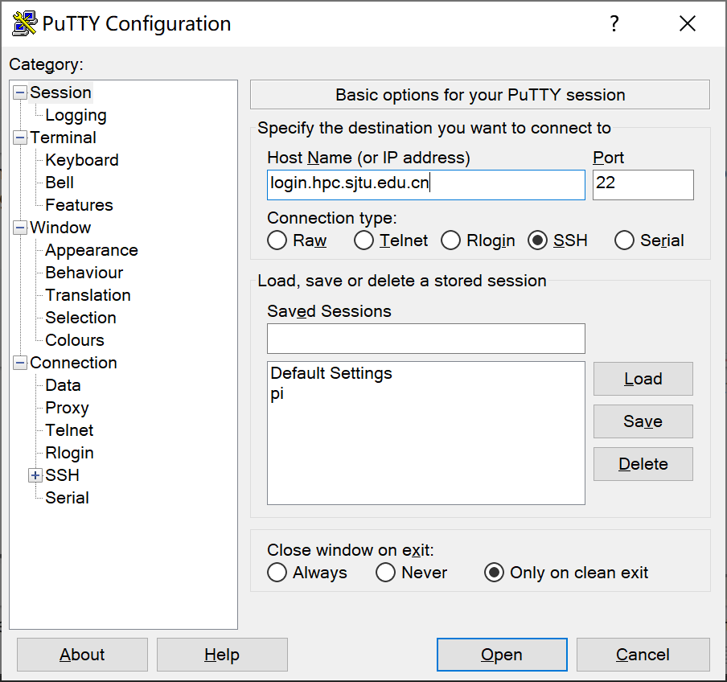

****
登录
****

通过 SSH 登录 

==========================

本文将向大家介绍如何通过 SSH 远程登录到服务器。在阅读本文档之前，您需要具备 Linux/Unix、终端、MS-DOS、SSH
远程登录的相关知识，或者您可以阅读参考资料理解这些概念。

本文主要内容：

-  使用 SSH 登录服务器注意事项；
-  首次登录准备，如信息采集、客户端下载、SSH 登录、SSH 文件传输、无密码登录等；
-  故障排除和反馈。

按照文档的操作说明将有助于您完成工作，谢谢您的配合！

注意事项
--------

-  账号仅限于同一课题组的成员使用，请勿将账号借给他人使用。
-  恶意的 SSH 客户端软件会窃取您的密码，请在官网下载正版授权 SSH 客户端软件。

准备
----

通过 SSH 登录服务器，需要在客户端输入登录节点 IP 地址（或主机名），SSH 端口，SSH 用户名和密码。

::

   SSH login node: 服务器 ip 地址
   Username: YOUR_USERNAME
   Password: YOUR_PASSWORD

登录节点 IP 地址为 192.168.8.10, SSH 端口为 22

下载客户端
----------

Windows
^^^^^^^

Windows 推荐使用 Putty 免费客户端，下载后双击即可运行使用。可至 \ `Putty 官网 <https://www.putty.org>`__\ 
下载。

Linux/Unix/Mac
^^^^^^^^^^^^^^

Linux / Unix / Mac 操作系统拥有自己的 SSH 客户端，包括 ssh, scp, sftp 等。

SSH 登录 

----------------------------

下面介绍通过 SSH 登录

Windows用户
^^^^^^^^^^^

启动客户端 Putty，填写登录节点地址 login.hpc.sjtu.edu.cn，端口号采用默认值 22，然后点 Open 按钮，如下图所示：

在终端窗口中，输入您的 SSH 用户名和密码进行登录：

.. image:: ../img/putty2.png

*提示：输入密码时，不显示字符，请照常进行操作，然后按回车键登录。*

Linux/Unix/Mac用户使用SSH
^^^^^^^^^^^^^^^^^^^^^^^^^

Linux / Unix / Mac 用户可以使用终端中的命令行工具登录。下列语句指出了该节点的IP地址、用户名和SSH端口。

.. code:: bash

   $ ssh YOUR_USERNAME@TARGET_IP

通过 SSH 传输文件
-----------------

登录可以通过scp等方式将个人目录下的数据下载到本地，或者反向上传本地数据到个人目录。详情请参考具体请参考 :ref:`label_transfer` 。

服务器网络资源有限，不推荐通过网络进行大批量的数据传输。

